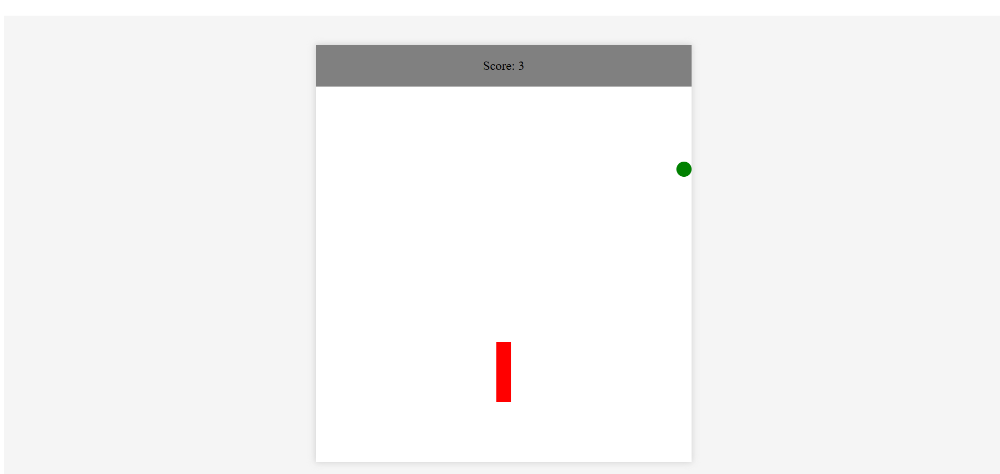

# 🐍 Snake Game

A classic **Snake Game** built using **HTML, CSS, and JavaScript**.

The player controls a snake that grows longer each time it eats food while avoiding collisions with itself.

---

## 🎮 Features

- Classic snake gameplay
- Dynamic food generation
- Score tracking
- Snake grows when food is eaten
- Game over when snake collides with itself
- Smooth keyboard controls
- Responsive game board

---

## 🛠️ Tech Stack

- **HTML** – Game structure  
- **CSS** – Styling and layout  
- **JavaScript** – Game logic and movement  

---

## 🚀 How to Run

1. Clone the repository

```
git clone https://github.com/yashaswinikaranam/snake-game.git
```

2. Open the folder

```
snake-game
```

3. Open `index.html` in your browser.

---

## 🎮 Controls

| Key | Action |
|----|----|
| ⬆️ Arrow Up | Move Up |
| ⬇️ Arrow Down | Move Down |
| ⬅️ Arrow Left | Move Left |
| ➡️ Arrow Right | Move Right |

---

## 📸 Screenshot



## 📌 Future Improvements

- High score system
- Difficulty levels
- Sound effects
- Mobile touch controls

---

## 👩‍💻 Author

**Yashaswini**

